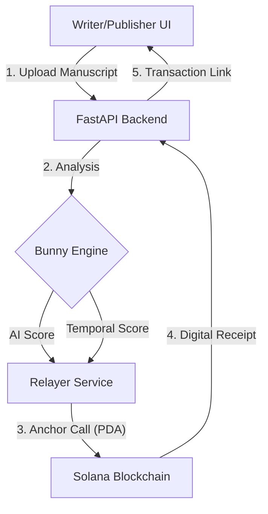

# Bunny — Decentralized Manuscript Attestation


https://github.com/user-attachments/assets/e9fcbaa4-01a8-4745-92dc-529a6de669cd


Proves human authorship by combining AI linguistic analysis with Proof of Process, anchored to Solana.

---

## Core Concepts

### 1. Humanity Score (A+ to F)
Unlike basic AI detectors, Bunny calculates a weighted score based on two layers:
- **Linguistic Layer (AI Engine)**: Uses `DeBERTa-v3` + custom heuristics (burstiness, vocabulary richness, etc.) to detect AI patterns.
- **Temporal Layer (Proof of Process)**: Analyzes the *evolution* of your manuscript over time. It rewards natural editing intervals (hours/days) and gradual word count changes.

---

## Technical Architecture (The Bridge)

Bunny operates on an **"Invisible Web3"** principle. Writers focus on their work, while our backend relayer handles the complexities of the blockchain.



### Engineering Flow
1. **Manuscript Fingerprinting**: We generate a unique SHA-256 hash of every manuscript version.
2. **Multi-Layer Analysis**: The backend runs linguistic heuristics and compares the new version against historical word-count/time deltas.
3. **Automated Relaying**: If humanity thresholds are met, the FastAPI backend uses a server-side wallet (The Relayer) to sign and pay gas fees for a Solana transaction.
4. **On-Chain PDA**: Data is stored in Program Derived Addresses (PDAs) on Solana, ensuring immutable proof of authorship without the user needing a wallet or SOL.


### 2. Proof of Process (PoP)
The system tracks "commits" of your manuscript. 
- **First Upload**: Baseline score of 50.
- **Subsequent Uploads**: Scores increase if the changes appear human (e.g., editing for 3 hours, adding 500 words).
- **Suspicious Activity**: Pasting 10,000 words in 5 minutes will flag the "Temporal Score," even if the text itself looks human.

### 3. Solana Relayer (Gasless)
Bunny uses a **Relayer Architecture**. Writers do not need a Solana wallet or SOL to attest their work. The backend signs and pays for the on-chain fingerprinting, making the experience "web2-friendly" while maintaining web3 immutability.

### 4. Privacy-First Fingerprinting
Only the **SHA-256 hash** of your manuscript and your scores are stored on-chain. Your actual text never touches the blockchain.

### 5. Demo & Simulations
For demonstration purposes, the frontend includes a **3.5-second simulation** for on-chain confirmation. It will display a placeholder transaction signature if the backend relayer is not fully configured with a live Solana key.

---

## Prerequisites

- Python 3.10+
- Node.js 18+
- (Optional) Rust + Solana CLI + Anchor — only needed if you want to rebuild/redeploy the on-chain program

---

## Setup

```bash
chmod +x setup.sh
./setup.sh
```

The script will:
1. Create a Python venv and install backend dependencies
2. Optionally install AI model deps (`torch` + `transformers`, ~2 GB, GPU recommended) — skip to use the built-in heuristic mock
3. Optionally install Solana SDK (`anchorpy`, `solders`, `solana`)
4. Run backend tests
5. Install frontend dependencies (`npm install`)

---

## Environment Variables

Create `backend/.env` (copy from `backend/.env.example`):

| Variable | Default | Notes |
|---|---|---|
| `USE_MOCK_MODEL` | `true` | Set to `false` only if you installed `torch` + `transformers` |
| `SOLANA_RPC_URL` | devnet | Leave as-is for local testing |
| `SOLANA_PRIVATE_KEY` | _(empty)_ | Relayer wallet (base58) — optional for local testing |
| `PROGRAM_ID` | _(placeholder)_ | Only needed if you deploy your own Anchor program |

> Without a `SOLANA_PRIVATE_KEY`, on-chain attestation is skipped but all analysis and scoring still works.

---

## Running Locally

Open two terminals:

**Terminal 1 — Backend** (port 8000)
```bash
cd backend
source venv/bin/activate
uvicorn main:app --reload
```

**Terminal 2 — Frontend** (port 3000)
```bash
cd frontend
npm run dev
```

Then open **http://localhost:3000**

API docs (Swagger): **http://localhost:8000/docs**

---

## Tests

```bash
cd backend
source venv/bin/activate
pytest tests/ -v
```
